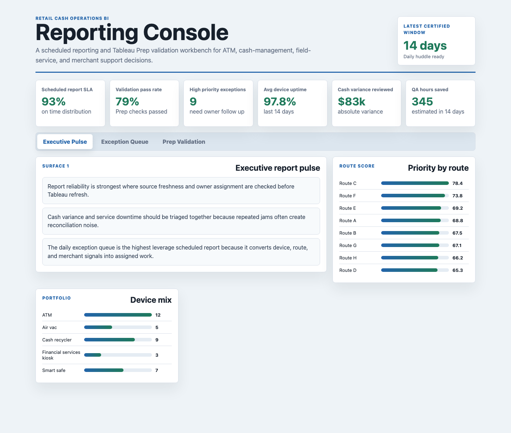
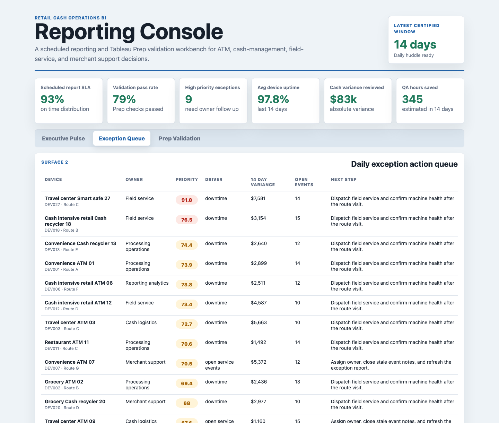
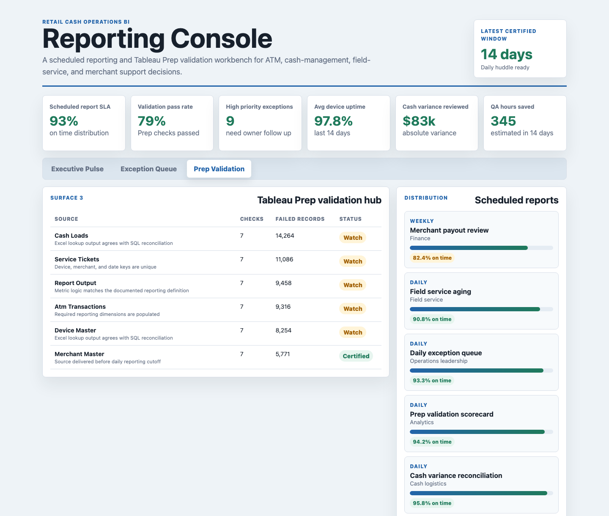

# Retail Cash Operations Reporting Console

Portfolio artifact for a data analyst role supporting retail cash management, ATM operations, field service, and recurring business reporting.

The project models how an analyst can move a reporting process from spreadsheet-heavy updates into a repeatable BI workflow: source extracts, validation checks, scheduled report monitoring, an exception queue, and concise stakeholder-ready findings.

## Portfolio Surface

### Executive Report Pulse



**Executive report pulse:** summarizes scheduled report SLA, validation pass rate, uptime, cash variance, high-priority exceptions, and estimated QA time saved. It gives operations leaders a fast view of whether recurring reports are ready for the daily huddle.

### Daily Exception Action Queue



**Daily exception action queue:** ranks devices and routes by cash variance, downtime, open events, owner team, and next action. This is the operational handoff that turns raw extracts into accountable follow-up.

### Tableau Prep Validation Hub



**Tableau Prep validation hub:** shows source-level validation checks, scheduled report distribution performance, and stakeholder acceptance tests. It demonstrates how a BI analyst can protect report accuracy before publishing a dashboard.

## Data Strategy

The data is synthetic and intentionally labeled as synthetic. Device-level ATM transactions, vault cash, merchant service events, report refresh logs, and payout reconciliation records are not public, so the generator creates role-realistic source tables modeled on common retail cash operations structures.

The synthetic model includes:

- 36 device or location master records across ATMs, cash recyclers, smart safes, air vac machines, and financial services kiosks.
- 4,320 daily device metric records over 120 days.
- 720 source-system events covering cash loads, jam clearance, communications alerts, report refresh delays, route service, merchant questions, and settlement review.
- 360 validation checks for freshness, duplicate keys, null required fields, threshold breaches, definition drift, and Excel-to-SQL reconciliation.
- 518 scheduled report runs across daily, weekly, and monthly recurring reports.
- 24 ranked exception actions with owner team, route, risk driver, value estimate, confidence, and next step.

The generator uses seeded distributions for transaction volume, deposits, uptime, cash variance, settlement variance, jam count, downtime minutes, source delays, validation failure rates, and report distribution status. Higher-risk devices receive wider variance, lower uptime, and more open events so the action queue has realistic priority separation.

## What This Demonstrates

This artifact is tailored to a reporting analyst role that values Excel, pivot-table logic, Tableau, Tableau Prep, SQL, relational data, data validation, and clear communication. It demonstrates:

- Translating stakeholder questions into report requirements and acceptance tests.
- Building source-style tables that could feed Tableau or SQL.
- Replacing manual VLOOKUP reconciliation with documented validation rules.
- Ranking daily exceptions with transparent business logic.
- Presenting findings in language that works for technical and non-technical stakeholders.

## Project Structure

| Path | Purpose |
|---|---|
| `index.html` | Static browser app with three reporting surfaces. |
| `src/app.js` | Renders the executive pulse, exception queue, and validation hub. |
| `src/data.js` | Generated static payload used by the browser app. |
| `data/` | Synthetic source-style CSV tables. |
| `analysis/outputs/` | Generated app payload, exception queue, and validation summaries. |
| `analysis/sql_checks.sql` | SQL examples for exception triage, validation gates, reconciliation, and report SLA checks. |
| `scripts/score_operating_data.py` | Deterministic data generator and scoring script. |

## Run Locally

```bash
npm run generate
npm start
```

Then open `http://localhost:4173`.

## Scope

This is a portfolio artifact, not a production reporting system. It does not connect to real merchant, ATM, banking, or payroll systems. It does show how the reporting workflow would be structured, validated, documented, and communicated if real source extracts were available.
