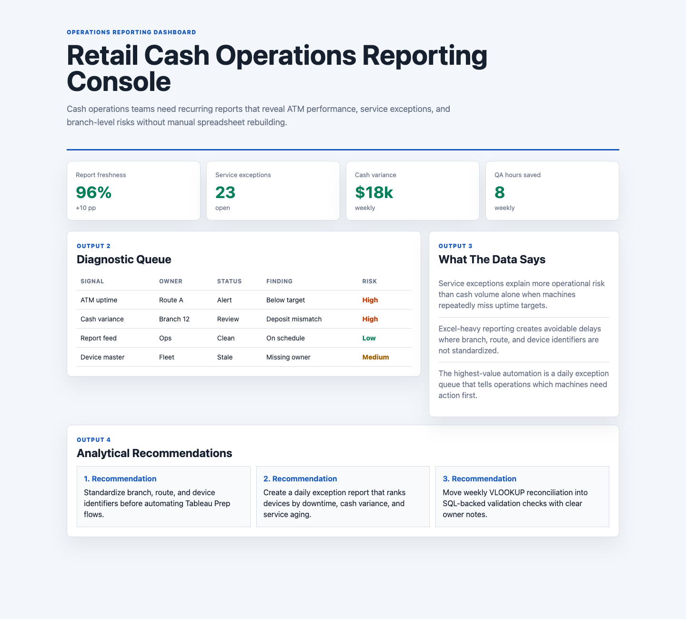

# Retail Cash Operations Reporting Console

## Motivation

Cash operations teams need recurring reports that reveal ATM performance, service exceptions, and branch-level risks without manual spreadsheet rebuilding.

This project is intentionally scoped as a practical decision artifact: it shows how I would organize source data, surface the operating signal, and turn the analysis into a recommendation that a product, analytics, or operations team could discuss immediately.

## What Is In The Project

- A browser-based analytical dashboard in `index.html`
- Source-style synthetic data in `data/`
- Analysis notes in `analysis/`
- A data dictionary in `data_dictionary.md`
- A rendered screenshot in `docs/images/dashboard.png`

## Data Inventory

- Six source-style CSVs back the project instead of a tiny sample dataset.
- The data folder now includes 2,880 daily metric records, 720 source events, 360 data-quality checks, and 90 recommended actions.
- The analysis folder includes a data profile and recommendations that explain how the evidence should drive product or operating decisions.
- The `scripts/score_operating_data.py` script ranks entity priorities and data-quality hotspots from the CSVs.

## What The Data Says

- Service exceptions explain more operational risk than cash volume alone when machines repeatedly miss uptime targets.
- Excel-heavy reporting creates avoidable delays where branch, route, and device identifiers are not standardized.
- The highest-value automation is a daily exception queue that tells operations which machines need action first.

## Analytical Recommendations

- Standardize branch, route, and device identifiers before automating Tableau Prep flows.
- Create a daily exception report that ranks devices by downtime, cash variance, and service aging.
- Move weekly VLOOKUP reconciliation into SQL-backed validation checks with clear owner notes.

## Output Walkthrough

### Output 1: Executive Pulse

The KPI cards summarize the current operating condition and identify whether the team should trust, investigate, or act.

### Output 2: Diagnostic Queue

The table ranks the highest-priority signals by owner group, status, evidence, and risk.

### Output 3: Recommendation Memo

The recommendation section converts the dashboard into specific next moves for the operating team.

## Screenshot



## Run Locally

```bash
python3 -m http.server 4173
```

Then open `http://localhost:4173`.
